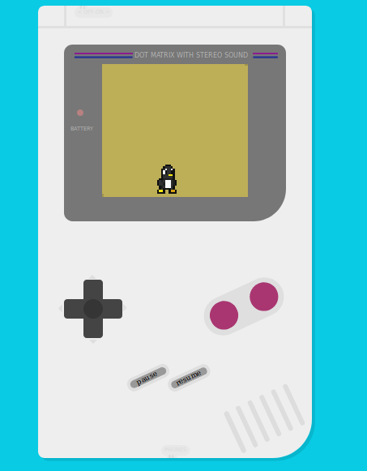

# Nuxt Phaser Example

> A nuxt phaser example using **[nuxtjs-phaser](https://www.npmjs.com/package/nuxtjs-phaser)** plugin.

In this example you'll see a simple integration between Nuxt and Phaser, using a community Nuxt plugin.
Some key binds have the intention to show integrations like a virtual gamepad.



## Why Nuxt?

Including Nuxt in your game Bundle, you can avoid problems with build javascript/typescript , besides use plugins like Adsense, Google Tag Manager, Workbox and other things in Nuxt ecosystem.

So the nuxtjs-phaser helps you to keep focus in your game.

## Build Setup

``` bash
# install dependencies
$ npm install # Or yarn install

# serve with hot reload at localhost:3000
$ npm run dev

# build for production and launch server
$ npm run build
$ npm start

# generate static project
$ npm run generate
```

## Live (powered by Surge.sh)

[Demo](https://nuxtjs-phaser.surge.sh/)

## References

- [Gameboy CSS](https://github.com/baumannzone/gameboy-css)
- [Tux Sprite](https://opengameart.org/content/tux-classic-hero-style)
